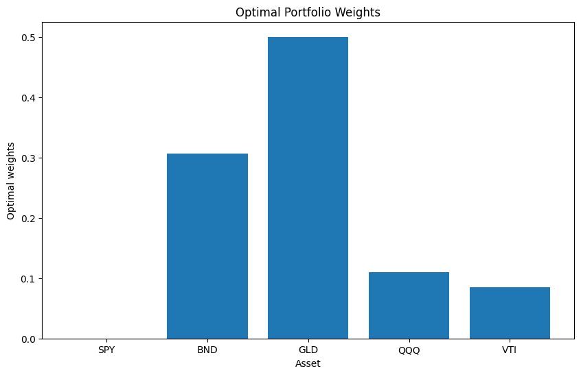

# Portfolio Optimization with Sharpe Ratio Maximization

This project focuses on optimizing a investment portfolio consisting of select ETFs (SPY, BND, GLD, QQQ, VTI) by maximizing the Sharpe Ratio. The process involves downloading historical adjusted close prices using the yfinance library, calculating daily logarithmic returns, and handling any missing data. The annualized covariance matrix of the log returns is then computed.

The core of the project lies in defining key portfolio performance metrics: standard deviation, expected returns (based on historical data), and the Sharpe Ratio, incorporating a risk-free rate obtained from the FRED API. An optimization problem is formulated to find the optimal portfolio weights that minimize the negative Sharpe Ratio (equivalent to maximizing the Sharpe Ratio), subject to constraints that the weights sum to one and individual asset weights are bounded between 0 and 0.5.

The optimization is performed using the `scipy.optimize.minimize` function with the 'SLSQP' method. Finally, the notebook analyzes the resulting optimal portfolio by calculating and printing its expected return, volatility, and Sharpe Ratio. A bar chart is generated to visualize the distribution of the optimal weights across the selected assets.

## How to Run

1. Clone the repository:
   ```bash
   git clone <repository_url>
   ```
2. Navigate to the project directory:
   ```bash
   cd <repository_name>
   ```
3. Install the required libraries:
   ```bash
   pip install -r requirements.txt
   ```
   *(Note: A `requirements.txt` file should be created listing the required libraries.)*
4. Obtain a FRED API key from [FRED website](https://fred.stlouisfed.org/docs/api/api_key.html).
5. Open the Jupyter Notebook `Customer_Segmentation_and_Analysis.ipynb` in a Jupyter environment (e.g., Jupyter Notebook, JupyterLab, VS Code with Python extension).
6. Replace the placeholder API key in the notebook with your actual FRED API key.
7. Run the cells sequentially.

## Optimal Portfolio Visualization

The following bar chart visualizes the optimal weights for each asset in the portfolio, as determined by the Sharpe Ratio maximization process. It shows how the investment is allocated across SPY, BND, GLD, QQQ, and VTI to achieve the highest risk-adjusted return based on the historical data analyzed.


